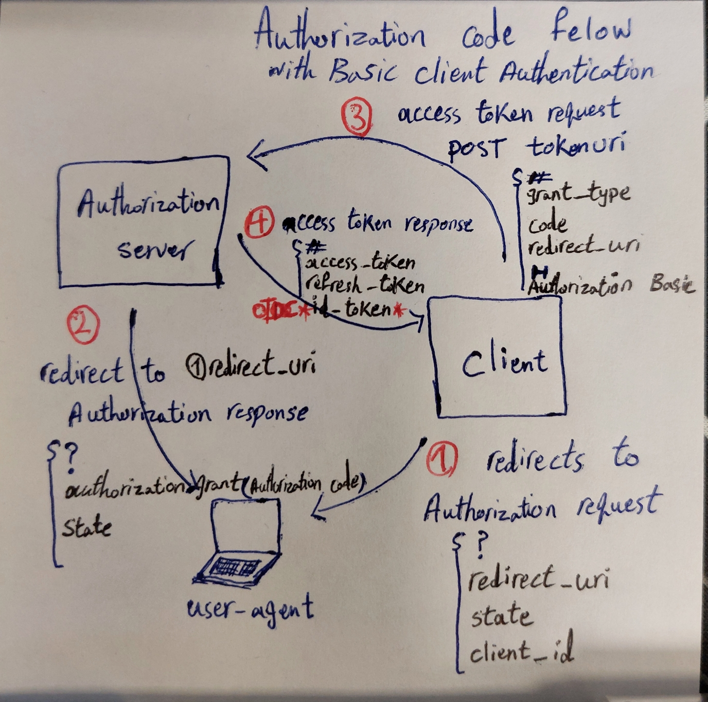

### The OAuth 2.0 Authorization Framework
`Single sign-on (SSO)`: The idea of SSO is to allow users to connect to many, different services by proving that they own the account of a single service.     

Today, two protocols are the main competitors when it comes to setting up SSO:     
- `Security Assertion Markup Language 2.0 (SAML)`(legacy protocol)—A protocol using the Extensible Markup Language (XML) encoding.     
- `OpenID Connect (OIDC)`—An extension to the OAuth 2.0 (RFC 6749) authorization protocol using the JavaScript Object Notation (JSON) encoding.    
---
**Identity and Access Management(IAM)**   
Identity and access management provides control over user validation and resource access.    
IAM is a discipline and a type of framework and a solution to `secure access to resources`.    
IAM systems require one or many authentication factors to verify identity.
IAM industry standards:    
- OAuth 2.0
- Open ID Connect
- JSON web tokens
- SAML

In the past, the standard for IAM was for a system to create and manage its own identity information for its users.    
Identity is like an *ID badge*.    
`Auth0` is an Identity platform.    
---
The OAuth 2.0 enables a third-party application to obtain limited access to an HTTP service(**OAuth 2.0 is designed for use with HTTP**, and heavily uses HTTP redirects),     
either on behalf of a resource owner,     
or by allowing the third-party application to obtain access on its own behalf.

OAuth Roles:
- **resource owner**
    - An entity capable of granting access to a protected resource.
       When the resource owner is a person, it is referred to as an `end-user`.    
    - For example: any person with Google account.
- **client**
    - An application that requests access to resources controlled by the resource owner.    
    - For example: any app with Google sign-in.    
- authorization server
    - The server issuing access tokens to the client after successfully authenticating the resource owner and obtaining authorization.    
    - For example: Google oauth service
- resource server
    - The server hosting the protected resources, capable of accepting and responding to protected resource requests using access tokens.    
    - For example: Google Drive service   

### OAuth 2.0 protocol flow
Client must register itself with authorization server first, and in return obtains `client id` and `client secret`.    

- **authorization request**:client redirects end-user to authorization server
- **authorization response**: after end-user successfully authenticates and authorize the client, authorization server redirects end-user to client with **authorization grant**.     
- **access token request**: The client requests an access token by authenticating with the authorization server and presenting the authorization grant.    
- **access token response**: The authorization server authenticates the client and validates the authorization grant, and if valid, issues an access token.     

### Authorization grant
An authorization grant is a credential representing the resource owner's authorization (to access its protected resources)     
used by the client to obtain an access token.    

The RFC specification defines four grant types:     
- authorization code
  - prevalent method for web app clients
  - client needs to authentication itself to obtain *access token*
- implicit
  - client obtains *access token* directly without intermediate credentials (such as an authorization code).    
  - authorization server does not authenticate the client.    
  - suitable for in-browser clients such as javascript client
- resource owner password credentials    
  - The resource owner password credentials (i.e., username and password) can be used directly as an authorization grant to obtain an access token.   
  - credentials should be used once to exchange for long term *access token* and shouldn't be stored.
  - suitable for highly trusted desktop app
- client credentials
  - when the client is also the resource owner

#### Authorization code flow
simple *authorization code* flow with Basic client authentication
    

---
### BFF pattern
Replace **general purpose API backend** with dedicated one backend per **user experience**.    
The general purpose API backend(API Gateway):     
A first step in accommodating more than one type of UI is normally to provide a single, server-side API, and add more functionality as required over time to support new types of mobile interaction:     
   the nature of a mobile experience often differs drastically from a desktop web experience. Firstly, the affordances of a mobile device are very different. We have less screen real estate, which means we can display less data. Opening lots of connections to server-side resources can drain battery life and limited data plans.     
   So in practice, our mobile devices will want to make different calls, fewer calls, and will want to display different (and probably less) data than their desktop counterparts. This means that we need to add additional functionality to our API backend to support our mobile interfaces.     

The BFF is tightly focused on a single UI.     
Place **reverse proxy** in front of BFF for:
- Caching
  - > BFF can also simplify caching somewhat as you can place a reverse proxy in front of the BFF, allowing you to cache the results of aggregated calls.   
- same origin between SPA and BFF
- SSL certificates

from Chris Richardson definition:     
>  A per-client API gateway providing each client with an API. This is the BFF pattern.   

Also, according to bff-patterns.com BFF alternative solutions like *API Gateway* or *GraphQL* might be more suitable,     
    In cases where client platforms are highly similar or few.      

### References
- [OAuth 2.0 RFC](https://datatracker.ietf.org/doc/html/rfc6749#section-4.1)
- [Auth0 IAM](https://auth0.com/docs/get-started/identity-fundamentals/identity-and-access-management) 
- [sam newman BFF pattern](https://samnewman.io/patterns/architectural/bff/#general)